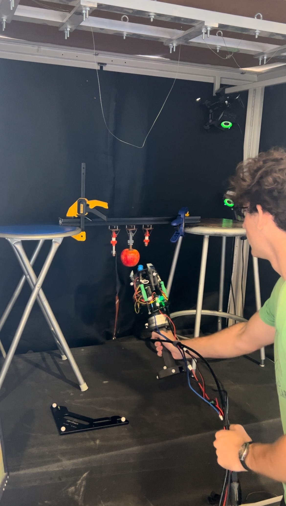
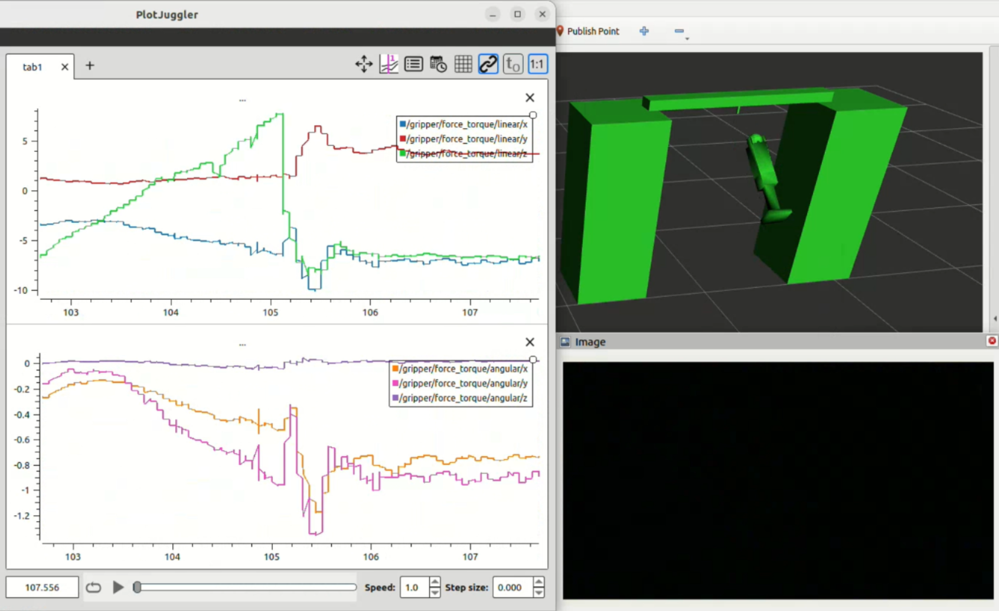

# Learning From Demonstration Data Collection to Pick Apples

This is a repository to collect apple picking data that will be used for Learning From Demonstration training. This repository was build on top of Ali Clara's ROS2 conversion of Alejo Velasquez's ROS1 apple proxy and gripper framework. Ali's repository can be found here(https://github.com/ali-clara/apple_gripper.git) and is listed under the GNU GPL license and Alejo's repository can be found here(https://github.com/velasale/suction-gripper) and is listed under the MIT license.

This repository contains scripts to use of Alejo's custom gripper with my custom modifications and a UR5e to run proxy apple picking tests. It uses MoveIt2 to move a UR5e end effector to sampled points around the circumference of the apple proxy and attempts a number of picks at each one. This allows us to test the effect of different variables on pick success.

Additionally, this repository contains the data and analysis I used to create the variable current control for the gripper's fingers. This is in `lfd_data_collection/data/force_current`.

Lastly, this repository also contains scripts to collect data from a human controlling the custom gripper using my custom LFD handle attachment. This attachment has a 6 axis force/torque sensor as well as OptiTrack markers to track the pose and forces. Once the data is collected, it can be aligned, played back, and visualized using scripts in this repository.

  

## Packages in the Repository:

- `gripper` - to control the gripper and UR5 for proxy picks
- `gripper_msgs` - service messages for the gripper package
- `lfd_data_collection` - to collect and playback data for learning from demonstration

## Getting Started:

### Dependencies

- [ROS2 Humble](https://docs.ros.org/en/humble/Installation/Ubuntu-Install-Debians.html), full desktop install preferred

- The [UR ROS2 driver](https://github.com/UniversalRobots/Universal_Robots_ROS2_Driver/tree/humble) (includes [MoveIt!](https://moveit.ros.org) support)

        sudo apt install ros-${ROS_DISTRO}-ur

- The [ROS2 joint state publisher](https://index.ros.org/p/joint_state_publisher/#humble)

        sudo apt install ros-humble-joint-state-publisher ros-humble-joint-state-publisher-gui

- [Pyserial](https://pyserial.readthedocs.io)

        pip install pyserial

- [Arduino IDE](https://docs.arduino.cc/software/ide-v2/tutorials/getting-started/ide-v2-downloading-and-installing/)

### Hardware

- UR5e
    - This repository has currently been tested only with **fake UR5e hardware** provided by the UR ROS2 driver. Creating a full simulation world was out of scope of this conversion, and setting up real hardware is coming soon.
    - More information about building a simulation or connecting to a real robot can be found in the [UR ROS2 driver documentation](https://docs.ros.org/en/ros2_packages/rolling/api/ur_robot_driver/index.html).

- My modifications of Alejo's gripper

    - A custom-built gripper tailored for picking apples. It uses suction cups and extendable fingers to grasp and pick and is controlled with an OpenRB-150, and contains sensors to aid in this.
    -A custom-build handle for humans to control the gripper. This handle has a 6 axis force/torque sensor and OptiTrack markers to collect pose and force/torque data.

### Installation:

Make a ROS2 workspace

    mkdir ros_ws && cd ros_ws && mkdir src && cd src

Clone this repository

    git clone https://github.com/jkarty3/apple_gripper.git

Install dependencies with [rosdep](https://docs.ros.org/en/humble/Tutorials/Intermediate/Rosdep.html)

    cd ~/ros_ws
    rosdep install --from-paths src -y --ignore-src

Build the workspace

    colcon build --symlink-install

## Connecting the in hand camera

The in hand camera connects directly to the computer through a usb cord and requires its own package to operate. Follow instructions [here](https://github.com/ANI717/ros2_camera_publish). Rename the publisher topic to `/gripper/camera`.

## Testing

### Testing the gripper

I reccomend adding the following aliases to your .bashrc to aid with testing and debugging.	
	
	alias fingersOpen='ros2 service call /set_fingers_status gripper_msgs/srv/GripperFingers "{set_fingers: False}"'
	alias fingersClose='ros2 service call /set_fingers_status gripper_msgs/srv/GripperFingers "{set_fingers: True}"'
	alias suctionOn='ros2 service call /set_vacuum_status gripper_msgs/srv/GripperVacuum "{set_vacuum: True}"'
	alias suctionOff='ros2 service call /set_vacuum_status gripper_msgs/srv/GripperVacuum "{set_vacuum: False}"'
	alias muxOn='ros2 service call /set_multiplexer_status gripper_msgs/srv/GripperMultiplexer "{set_multiplexer: True}"'
	alias muxOff='ros2 service call /set_multiplexer_status gripper_msgs/srv/GripperMultiplexer "{set_multiplexer: False}"'

The `suction_gripper` node communicates with an OpenRB-150 through Pyserial to control the gripper vacuum and fingers. When it recieves a service call, it sends an integer between 1-6 corresponding to vacuum on/off, fingers engaged/disengaged, and multiplexer on/off.

Connect to an OpenRB-150, and upload `suction_gripper.ino` from the *gripper/arduino* directory using the ArduinoIDE. Ensure the **baud rate** and **port** match the baud and port set in `suction_gripper.py`.

To see the OpenRB-150 response to a serial command, open the serial monitor and type `<1>`. If everything is set up correctly, the serial monitor will return `Arduino: turning vacuum on`, and the relay should be triggered. Type `<2>` to turn it off. Once OpenRB-150 functionlity is verified, close the IDE.

In one shell, start the suction gripper node:

    ros2 run gripper suction_gripper.py

In a second shell, call the gripper vacuum or fingers service, e.g:

    fingersClose

The first shell will log the same serial output as the test with the Arduino IDE, and the relay should again be triggered. 

Next, ensure that the OpenRB-150 can publish data correctly. In the second shell, call the mulitplexer service.

    muxOn

Now check that the topics are publishing.

    ros2 topic echo /gripper/distance

### Testing the force/torque sensor

Run the node that publishes force/torque data

    ros2 run lfd_data_collection force_torque_sensor.py

Ensure that the topic is publishing properly:

    ros2 topic echo gripper/force_torque

## Running the data collection sequence

First setup OptiTrack. Ensure that there are exactly 11 markers visible (3 for the origin, 5 on the base of the handle, and one on each finger). Select the 5 markers on the base of the handle and create a rigid body with them. Then start recording data.

Next start the data collection sequence. In one terminal launch the data collection nodes:

    ros2 launch lfd_data_collection data_collection_launch.py

In another terminal run the main node and rosbag:

    ros2 run lfd_data_collection LFD.py

Go through the pick sequence. This will save a rosbag in `/apple_gripper/lfd_data_collection/data/bags`. Then export the OptiTrack data as a csv and place it in `/apple_gripper/lfd_data_collection/data/optitrack`.

## Running the data playback sequence

  

Optionally use plotjuggler to visualize the force/torque data during the playback:

    sudo apt install ros-$ROS_DISTRO-plotjuggler-ros
    ros2 run plotjuggler plotjuggler

Next launch all of the nodes for playback. `arg1` is the path to the optitrack file relative to the data folder, and `arg2` is the path to the rosbag file relative to the data folder.

    ros2 launch lfd_data_collection data_playback_launch.py arg1:="optitrack/Take 2024-08-16 12.02.44 AM.csv" arg2:=bags/20240816_8

Optionally load the scene in rviz. In the MotionPlanning tab, click `Scene Objects`, then `Import`, and open `src/apple_gripper/gripper/config/LFD_scene_geometry.scene`

Finally navigate to the bags folder and run the corresponding rosbag.

    cd ~/ros_ws/src/apple_gripper/lfd_data_collection/data/bags
    ros2 bag play 20240816_8

