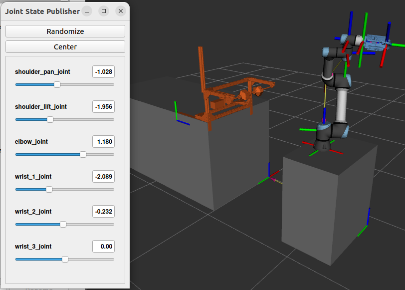

# Apple Picking Experiements with Apple Proxy & Custom Gripper

This is a repository for the ROS2 conversion of Alejo Velasquez's ROS1 apple proxy & gripper framework. The original source code can be found at [github.com/velasale/suction-gripper](https://github.com/velasale/suction-gripper) and is listed under the MIT license.

This repository contains scripts to use Alejo's custom gripper and a UR5e to run proxy apple picking tests. It uses MoveIt2 to move a UR5e end effector to sampled points around the circumference of the apple proxy and attempts a number of picks at each one. This allows us to test the effect of different variables on pick success.

  

## Packages in the Repository:

- `gripper` - 
- `gripper_msgs` - 

## Getting Started:

### Dependencies

- [ROS2 Humble](https://docs.ros.org/en/humble/Installation/Ubuntu-Install-Debians.html), full desktop install preferred

- The [UR ROS2 driver](https://github.com/UniversalRobots/Universal_Robots_ROS2_Driver/tree/humble) (includes [MoveIt!](https://moveit.ros.org) support)

        sudo apt install ros-${ROS_DISTRO}-ur

- The [ROS2 joint state publisher](https://index.ros.org/p/joint_state_publisher/#humble)

        sudo apt install ros-humble-joint-state-publisher ros-humble-joint-state-publisher-gui

- [Pyserial](https://pyserial.readthedocs.io)

        pip install pyserial

- [Arduino IDE](https://docs.arduino.cc/software/ide-v2/tutorials/getting-started/ide-v2-downloading-and-installing/)

### Hardware

- UR5e
    - This repository has currently been tested only with **fake UR5e hardware** provided by the UR ROS2 driver. Creating a full simulation world was out of scope of this conversion, and setting up real hardware is coming soon.
    - More information about building a simulation or connecting to a real robot can be found in the [UR ROS2 driver documentation](https://docs.ros.org/en/ros2_packages/rolling/api/ur_robot_driver/index.html).

- My modifications of Alejo's gripper

    - A custom-built gripper tailored for picking apples. It uses suction cups and extendable fingers to grasp and pick and is controlled with an OpenRB-150.

- An OpenRB 150

    - This controls 3 pressure sensors, a distance sensor, as well as the servo motor. More information on setting up [here](https://emanual.robotis.com/docs/en/parts/controller/openrb-150/).

### Installation:

Make a ROS2 workspace

    mkdir ros_ws/src && cd src

Clone this repository

    git clone https://github.com/jkarty3/apple_gripper.git

Install dependencies with [rosdep](https://docs.ros.org/en/humble/Tutorials/Intermediate/Rosdep.html)

    cd ~/ros_ws
    rosdep install --from-paths src -y --ignore-src

Build the workspace

    colcon build --symlink-install

If you get an error `Could not find a package configuration file provided by "gripper_msgs" with any of the following names:` Remove the previous build, build the `gripper_msgs`, source the `setup.bash`, then build the `gripper`.
    
    rm -rf build install log
    colcon build --packages-select gripper_msgs
    source ~/ros_ws/install/setup.bash
    colcon build --packages-select gripper
    source ~/ros_ws/install/setup.bash

## Connecting the in hand camera

The in hand camera connects directly to the computer through a usb cord and requires its own package to operate. Follow instructions [here](https://medium.com/@kabilankb2003/integrating-pi-camera-with-ros-2-humble-on-nvidia-jetson-nano-using-opencv-de676dd6a2ca). Rename the topic publisher name to `/gripper/camera`.

If you choose to use a different package with more functionality, again rename the topic publisher to `/gripper/camera`. Also, make sure to edit the launch file `gripper/launch/suction_gripper_launch.py` to launch the publisher.

## Testing

After installation, the following commands can test the functionality of different components.

### RVIZ world & joint state publisher

To ensure the RVIZ world loads correctly and the joint state publisher controls the UR5e joints, run:

    ros2 launch gripper ur5e_launch.py

This loads the following scene, showing the UR5e and apple proxy with the TF tree. It also runs the joint state publisher GUI, which controls the UR5e joint positions.

  

### Suction gripper Pyserial interface

The `suction_gripper` node communicates with an OpenRB-150 through Pyserial to control the gripper vacuum and fingers. When it recieves a service call, it sends an integer between 1-6 corresponding to vacuum on/off, fingers engaged/disengaged, and multiplexer on/off.

Connect to an OpenRB-150, and upload `suction_gripper.ino` from the *gripper/arduino* directory using the ArduinoIDE. Ensure the **baud rate** and **port** match the baud and port set in `suction_gripper.py`.

To see the OpenRB-150 response to a serial command, open the serial monitor and type `<1>`. If everything is set up correctly, the serial monitor will return `Arduino: turning vacuum on`, and the relay should be triggered. Type `<2>` to turn it off. Once OpenRB-150 functionlity is verified, close the IDE.

In one shell, start the suction gripper node:

    ros2 run gripper suction_gripper.py

In a second shell, call the gripper vacuum or fingers service, e.g:

    ros2 service call /set_vacuum_status gripper_msgs/srv/GripperVacuum "{set_vacuum: True}"

The first shell will log the same serial output as the test with the Arduino IDE, and the relay should again be triggered. 

Next, ensure that the OpenRB-150 can publish data correctly. In the second shell, call the mulitplexer service.

    ros2 service call /set_multiplexer_status gripper_msgs/srv/GripperMultiplexer "{set_multiplexer: True}"

Now check that the topics are publishing.

    ros2 topic list
    ros2 topic echo /gripper/distance

## Running the Proxy Pick sequence

Launch the UR robot driver with fake hardware:

    ros2 launch ur_robot_driver ur_control.launch.py ur_type:=ur5e robot_ip:=yyy.yyy.yyy.yyy use_fake_hardware:=true launch_rviz:=false

Launch the RVIZ world, start MoveIt2 arm control, and connect to the gripper:

    ros2 launch gripper suction_gripper_launch.py

Finally, run the user interface and start the pick sequence - **must be run from the `gripper` package directory**:

    ros2 run gripper user.py --ros-args --params-file config/apple_proxy_parameters.yaml

The `user` node first prompts the user for inputs about the current experiment setup. It then asks to start the proxy pick sequence, which runs through a set number of trials at specified locations. Upon completion, it saves metadata about the trial.

